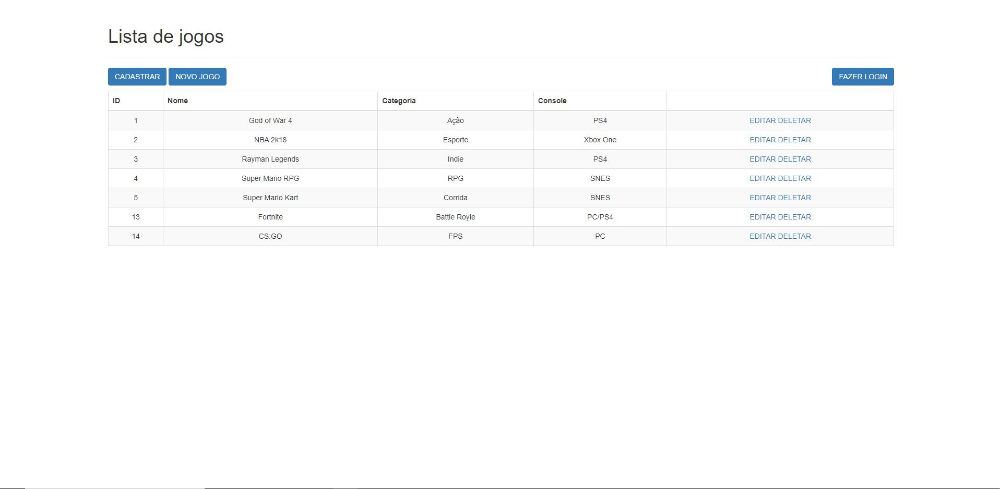

# Projeto desenvolvido com base no curso da Alura de Flask Parte 2
 
<h1 align="center" >
 
  
 
</h1>

<a href="https://cursos.alura.com.br/certificate/010e0730-e589-4700-bf10-b707dc2d9432">
  

      
Check my credential!

  

</a>

Ola! Segue a baixo algumas informções sobre o projeto.

## 🚀 Technologies

Este projeto foi desenvolvido com as seguintes tecnologias:

- ✔️ Python 
- ✔️ Flask
- ✔️ MySQL
- ✔️ Bootstrap
- ✔️ HTML
- ✔️ JavaScript
- ✔️ JQuery

Habilidades desenvolvidas:

- ✔️ Crie um CRUD completo
- ✔️ Salve os dados no banco de dados
- ✔️ Crie um upload de arquivos
- ✔️ Use JavaScript e jQuery na aplicação web
- ✔️ Organize o seu projeto de maneira correta

Descrição:

Essa é uma aplicação onde os usuarios podem fazer login, se resgitrar, fazer o upload de imagens para servidor, cadastrar jogos, alterar foto de jogos, etc. 
As rotas de alterações são protegidas, o usuario só consegue alterar se estiver logador. 
O sistema é simples, o padão de autenticação não é o mais indicado, porem, para fins de estudos foi um otimo projeto. Em breve, quero trazer mais algumas funcionalidades e deixar o sistema mais robusto. 

